# BitByBit Hybrid Orchestrator

*Hierarchical + Parallel + Sequential orchestration with **BitNet** as the core reasoner and **TinyBERT** as dual-layer safeguards (edge‑ready).*

<div align="center">

  <!-- Hero / Goal badges (GitHub-safe) -->

  <a href="#what-is-this">
    
  </a>
  &nbsp;
  <a href="#architecture-at-a-glance">
    
  </a>
  &nbsp;
  <a href="#quickstart">
    
  </a>

<br/><br/>

  <!-- Row 1: Primary badges -->

  <a href="https://colab.research.google.com/drive/1WZw9Ro4L1X9pZP34VEbJ0pTs5IbdPREv?usp=sharing">
    
  </a>
  &nbsp;
  <a href="docs/">
    
  </a>
  &nbsp;
  <a href="https://github.com/xgrayfoxss21/bitbybit-hybrid-orchestrator/actions">
    
  </a>
  &nbsp;
  <a href="LICENSE">
    
  </a>
  &nbsp;
  <a href="https://img.shields.io/badge/status-alpha-orange">
    
  </a>

<br/><br/>

  <!-- Row 2: Security & Governance -->

  <a href="SECURITY.md">
    
  </a>
  &nbsp;
  <a href="COMPLIANCE.md">
    
  </a>
  &nbsp;
  <a href="security/pgp/xgrayfoxss21.asc">
    
  </a>
  &nbsp;
  <a href="https://github.com/xgrayfoxss21/bitbybit-hybrid-orchestrator/security/advisories/new">
    
  </a>

<br/><br/>

  <!-- Row 3: Quick links -->

<a href="https://github.com/xgrayfoxss21/bitbybit-hybrid-orchestrator"><b>🏠 Repo</b></a>
 •  <a href="https://github.com/xgrayfoxss21/bitbybit-hybrid-orchestrator/issues"><b>🐞 Issues</b></a>
 •  <a href="https://github.com/xgrayfoxss21/bitbybit-hybrid-orchestrator/discussions"><b>💬 Discussions</b></a>
 •  <a href="https://github.com/xgrayfoxss21/bitbybit-hybrid-orchestrator/releases"><b>📦 Releases</b></a>
 •  <a href="docs/roadmap.md"><b>🗺️ Roadmap</b></a>
 •  <a href="docs/api.md"><b>🧩 Pipeline API</b></a>
 •  <a href="docs/chat.md"><b>💬 Chat mode</b></a>
 •  <a href="orchestrator/pipeline.yml"><b>🧪 Example pipeline.yml</b></a>
 •  <a href="CHANGELOG.md"><b>📝 Changelog</b></a>
 •  <a href="https://github.com/xgrayfoxss21"><b>🔗 GitHub Profile</b></a>

</div>

> **Status:** alpha v0.002 • **License:** AGPL‑3.0‑or‑later • **Owner:** **Foxes Den Corp (Grayfox)**

---

## What is this? *(alpha v0.002)*

A compact orchestration engine that mixes **hierarchical**, **parallel**, and **sequential** patterns in a single execution DAG:

* **BitNet agents** (currently: `text_processor`, `summarizer`) handle reasoning tasks (clean, sentiment, entities, summarize) with a BitNet‑style quantization layer for lean CPU/GPU runs.
* **TinyBERT Guard** enforces safety at **input**, optional **per‑node gates**, and **output** — PII redaction hooks + moderation (toxicity, jailbreak, context risk).
* Designed for **on‑device / edge**: phones, SBCs, lean VPS.

This repo includes a **Colab demo**, a **YAML→DAG** pipeline config, a **Docs** folder, and **multi‑turn chat** UI.

---

## Feature map (your sections)

* **A. Blueprint Foundation — ✅**
  Architecture, DAG scheduler, safety layer, config‑as‑data, metrics, and roadmap. (Colab Cells **6/6** + **7/7** wire everything end‑to‑end.)
* **B. Section 1 MVP (Core Intelligence) — 🟨**
  Working skeleton agents (`text_processor`, `summarizer`) with swap points for real BitNet backends; claim‑check/synthesis stubs mapped for extension.
* **C. Section 2 MVP (Learning Loop) — ⏳**
  Hooks reserved for data curation, eval harness, fine‑tuning loops.
* **D. Section 3 MVP (Autonomous Logic) — 🟨**
  Planning heuristics, retries/fallbacks, budget‑aware routing; extendable to multi‑episode planning.
* **E. Section 4 MVP (User Interface) — ✅**
  CLI, **Web UI** (single‑turn & multi‑turn chat), monitoring panes (Colab **Cell 7/7**) + standalone Gradio app.

---

## Architecture (at a glance)

```mermaid
flowchart TD
  A["User Input"] --> G1["TinyBERT: Input Filter"]
  G1 --> O["Hierarchical Orchestrator • plan DAG"]
  O --> P["Parse/Intent"]
  P --> C1["Claim Check 1"]
  P --> C2["Claim Check 2"]
  C1 --> R["Reduce/Synthesis"]
  C2 --> R
  R --> G2["TinyBERT: Output Moderation"]
  G2 --> X["Response"]
```



* **Mixed orchestration:** parallel branches for independent checks; sequential where dependencies exist.
* **Safety as functions:** guards can wrap the whole flow or selected nodes.

---

## Quickstart

### Option 1 — Colab (zero setup)

Open the notebook:
**[▶ Launch in Colab](https://colab.research.google.com/drive/1WZw9Ro4L1X9pZP34VEbJ0pTs5IbdPREv?usp=sharing)**

* **System init + tests:** run **Cell 6/6** (Complete System).
* **Interactive Web UI (chat + builder + monitor):** run **Cell 7/7**.
* **Alt simple chat (secondary UI):** run the *Simple Chat Interface* cell (spawns another Gradio app).
* **Chat mode (multi‑turn):** details in **[docs/chat.md](docs/chat.md)**.

### Option 2 — Local (Python 3.10+)

```bash
git clone https://github.com/xgrayfoxss21/bitbybit-hybrid-orchestrator.git
cd bitbybit-hybrid-orchestrator

# macOS/Linux
python -m venv .venv && source .venv/bin/activate
# Windows (PowerShell)
# python -m venv .venv; . .\.venv\Scripts\Activate.ps1

pip install -r orchestrator/requirements.txt
```

Run the tiny CLI demo (optional):

```bash
python orchestrator/cli.py --input "Contact test@example.com. BitNet b1.58 ... TinyBERT ..."
# or
python orchestrator/cli.py --input @sample.txt
```

**Standalone full app (local Gradio UI + agents + guard):**

```bash
python standalone/bitnet_tinybert_orchestrator_standalone.py
# opens http://127.0.0.1:7860 (primary UI)
```

---

## Optional Web UIs (Gradio)

We keep UI deps separate for lean edge installs.

```bash
# Only if you want the web UIs
pip install -r ui/requirements.txt
```

**Single‑turn UI (local):**

```bash
python ui/gradio_demo.py
```

**Chat mode (multi‑turn):**

* **Colab:** run **Cell 7/7 — Interactive Interface** (includes chat).
* **Local:** use:

```bash
python ui/chat_gradio.py
# secondary chat app defaults to http://127.0.0.1:7861
```

*(The standalone script also launches a Gradio UI; the simple chat cell in Colab spins up a second app.)*

---

## Repository layout

```
.
├─ docs/                         # Repo-hosted docs (optional GitHub Pages later)
│  ├─ index.md
│  ├─ quickstart.md
│  ├─ architecture.md
│  ├─ safety.md
│  ├─ api.md
│  ├─ roadmap.md
│  ├─ colab.md
│  └─ chat.md                   # Multi-turn chat guide
│  └─ assets/
│     ├─ logo.svg
│     └─ diagram-overview.png
├─ orchestrator/
│  ├─ pipeline.yml              # Example pipeline (YAML→DAG)
│  ├─ pipeline.chat.yml         # Chat pipeline sample
│  ├─ requirements.txt
│  └─ cli.py                    # Tiny CLI runner
├─ standalone/
│  └─ bitnet_tinybert_orchestrator_standalone.py  # All-in-one app (Win11 CPU/GPU-friendly)
├─ ui/
│  ├─ requirements.txt          # gradio, nest_asyncio (optional UI deps)
│  ├─ gradio_demo.py            # Single-turn local app
│  └─ chat_gradio.py            # Multi-turn local chat app
├─ notebooks/
│  └─ BitByBit_TinyBERT_Orchestrator_Colab.ipynb
├─ .github/
│  ├─ ISSUE_TEMPLATE/
│  │  ├─ bug_report.md
│  │  ├─ feature_request.md
│  │  └─ config.yml
│  └─ workflows/
│     └─ ci.yml
├─ SECURITY.md • CODE_OF_CONDUCT.md • CONTRIBUTING.md
├─ COMPLIANCE.md • THIRD_PARTY_LICENSES.md • CHANGELOG.md
├─ security/pgp/xgrayfoxss21.asc
├─ LICENSE
└─ README.md
```

---

## Pipeline as data (example)

```yaml
# orchestrator/pipeline.yml
name: summarize_and_verify
budgets: { latency_ms: 1800, max_concurrency: 2, memory_mb: 1200 }
models: { reasoner: distilbert-base-uncased (bitnet-quantized), guard: tinybert-onnx-int8 }
policies:
  thresholds: { toxicity_block: 0.5, pii_redact: 0.7, jailbreak_block: 0.6 }
nodes:
  - id: clean_text
    agent: text_processor
    guard_pre: true
    guard_post: true
    params: { operation: clean }

  - id: analyze_text
    agent: text_processor
    deps: [clean_text]
    params: { operation: sentiment }

  - id: summarize_text
    agent: summarizer
    deps: [clean_text]
    params: { max_length: 200 }

  # Example parallel validation branches (swap in your own agents later)
  - id: claim1
    agent: text_processor
    deps: [clean_text]
    params: { operation: entities }

  - id: claim2
    agent: text_processor
    deps: [clean_text]
    params: { operation: language }

  - id: reduce
    agent: summarizer
    deps: [claim1, claim2]
    params: { max_length: 120 }
```

---

## Swapping the real backends

* **BitNet reasoner:** wire your BitNet runtime (e.g., bitnet.cpp / ONNX EP) behind existing agent signatures; current default loads lightweight Transformer backbones and applies BitNet‑style **dynamic int8** quantization where supported.
* **TinyBERT guard:** keep ONNX INT8 or rule‑based hybrid; tune thresholds; taxonomy hooks provided.
* **RAG:** replace toy sources with DuckDB + FAISS (or your vector DB) behind a `retriever` agent.

---

## AGPL‑3.0‑or‑later (network use) — what you must do

If you host a modified version over a network, **AGPL §13** requires offering users the **Corresponding Source** of your modifications:

* Add a **“Source”** link (or `/source` endpoint) that points to the exact commit running.
* Include an HTTP header:

  ```
  X-AGPL-Source: https://github.com/xgrayfoxss21/bitbybit-hybrid-orchestrator/tree/<COMMIT_SHA>
  ```
* See **COMPLIANCE.md** for drop‑in examples (UI footer, API headers, Docker labels).

---

## Models & third‑party licenses

This repo’s code is AGPL‑3.0‑or‑later. **Model weights and some libraries may have different licenses** (Apache‑2.0, MIT, OpenRAIL, etc.). Track them in **THIRD\_PARTY\_LICENSES.md** and respect each model’s terms.

---

## Contributing

Pull requests welcome! Please read **CONTRIBUTING.md** and follow the DCO/CLA guidance. Keep SPDX headers in source files:

```
SPDX-License-Identifier: AGPL-3.0-or-later
```

---

## Security

See **SECURITY.md** for how to report vulnerabilities. Do **not** file sensitive issues publicly.

---

## License

This project is licensed under **GNU AGPL‑3.0‑or‑later** — see [LICENSE](LICENSE).
If you interact with it over a network, you must provide users access to the Corresponding Source (AGPL §13).

---

## Owner

**Foxes Den Corp (Grayfox)** — [https://github.com/xgrayfoxss21](https://github.com/xgrayfoxss21)

## Project Website

**Bitbybit collective** — [ https://bit.foxesden.xyz/](https://bit.foxesden.xyz/)
