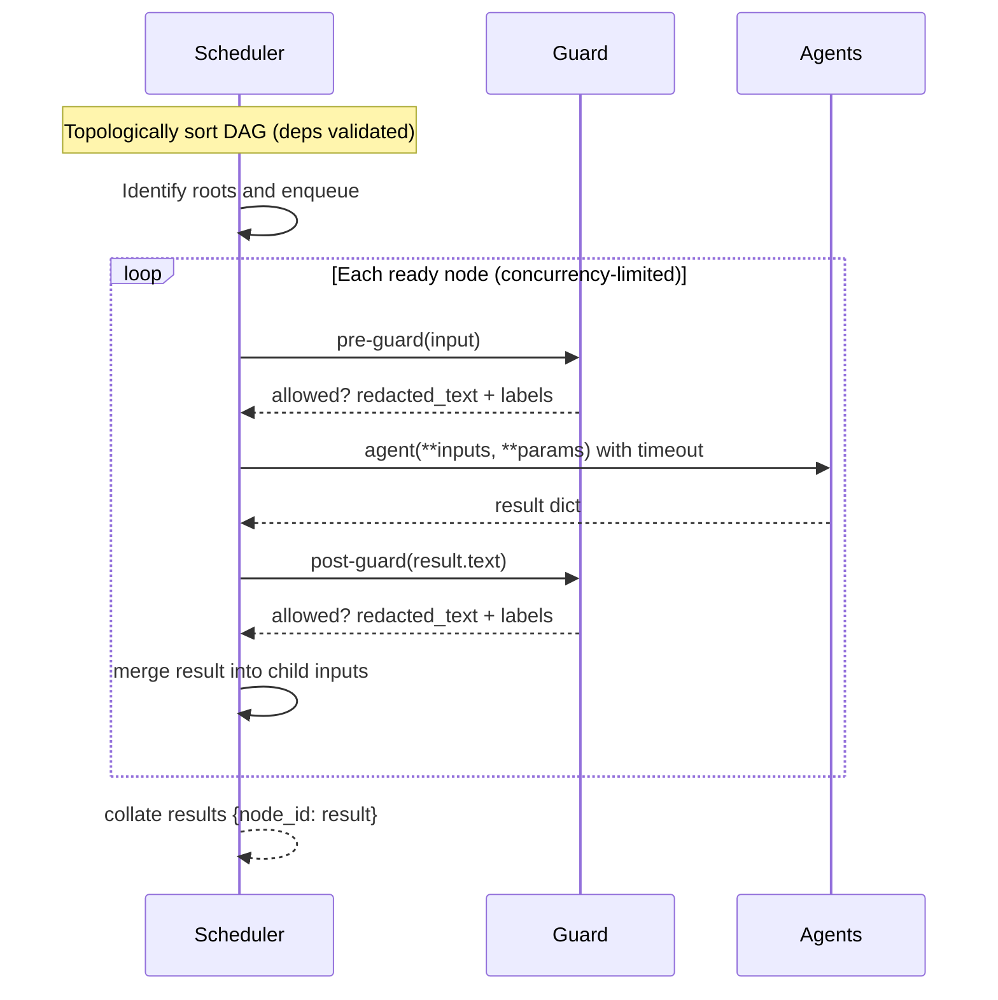

````markdown
# Architecture

This document explains how the **BitNet Hybrid Orchestrator** is put together: the core runtime (Node/Registry/Scheduler), the **TinyBERT Guard**, placeholder **agents** you can swap for BitNet backends, and the optional **chat mode** that preserves context across turns.

- **Execution model:** hierarchical planning, sequential dependencies, and parallel branches in a single DAG.
- **Safety:** pre-/post-guard on selected nodes with PII redaction and moderation cards.
- **Config-as-data:** pipelines defined in YAML (`orchestrator/pipeline.yml`, `orchestrator/pipeline.chat.yml`).

---

## High-level flow

```mermaid
flowchart TD
  A["User Input"] --> G1["TinyBERT Guard (input)"]
  G1 -->|redacted text| O["Orchestrator (Scheduler)"]
  O --> P["Parse / Intent (summarizer)"]
  P --> C1["Claim Check 1"]
  P --> C2["Claim Check 2"]
  C1 --> R["Reduce / Synthesis"]
  C2 --> R
  R --> G2["TinyBERT Guard (output)"]
  G2 --> X["Response"]
````

* The **Scheduler** executes a DAG of **Nodes**. Parents feed their outputs into children (shallow merge).
* The **Guard** may run at the **pipeline boundary** (input/output) and/or **per-node**.
* The default demo runs `parse → [claim1, claim2] → reduce`.

---

## Components

### 1) Node (data model)

```python
from dataclasses import dataclass, field
from typing import Any, Dict, List

@dataclass
class Node:
    id: str
    agent: str                # registry key, e.g., "bitnet.summarizer"
    deps: List[str] = field(default_factory=list)
    guard_pre: bool = True    # run guard on input to this node
    guard_post: bool = True   # run guard on output of this node
    timeout_ms: int = 1000
    max_retries: int = 0
    params: Dict[str, Any] = field(default_factory=dict)
```

* **Inputs** to a node are the **shallow merge** of all parent outputs plus top-level `sources`.
* **Params** are merged last and may override keys from inputs when needed.

### 2) Registry (agent lookup)

* A lightweight mapping from `name → async function`.
* Contract: `async def agent(**kwargs) -> dict` returning **at least** `{"text": "..."}`.
* Demo agents (swap with real BitNet backends at any time):

  * `bitnet.summarizer` (deterministic extractive summary)
  * `bitnet.claimcheck` (token-overlap heuristic)
  * `bitnet.synthesis` (executive brief reducer)

### 3) Scheduler (DAG executor)

* Validates dependencies and executes nodes topologically.
* Runs ready nodes in parallel under a **semaphore** (see `budgets.max_concurrency`).
* Applies per node:

  * **Pre-guard**: `guard.check(..., mode="input")`
  * **Post-guard**: `guard.check(..., mode="output")`
  * **Timeouts**: `timeout_ms`
  * **Retries**: up to `max_retries` with a short backoff
* Produces `{node_id: result_dict}`, where each `result_dict` may include:

  * `text: str` (primary payload)
  * `_moderation: list` (per-guard moderation cards)
  * `_node: str` (node id)
  * `_error: str` (if execution failed)

### 4) Guard (TinyBERT-style)

* Provides **PII redaction** (email/phone via regex) and optional learned signals.
* Modes:

  * `regex-only` (default; jailbreak heuristics + PII regex)
  * `onnx+regex` (if **TinyBERT ONNX** model + tokenizer are provided)
* Default thresholds (also configurable in YAML):

  * `toxicity_block`, `jailbreak_block`, `pii_redact`
* Output: a **moderation card** (see schema below) attached to node results.

Environment knobs:

```bash
# Enable learned signals (optional)
TINYBERT_ONNX_PATH=/abs/path/to/tinybert-int8.onnx
TINYBERT_TOKENIZER_DIR=/abs/path/to/tokenizer

# Force regex-only mode (ignores ONNX if present)
GUARD_DISABLE_ONNX=1
```

---

## Execution lifecycle



**Error handling**

* A failed node (timeout/exception/guard block) yields a result with `"_error"`.
* Downstream nodes still receive the partial merge from any successful parents.
* The Scheduler surfaces `dag_unresolved_nodes` if cycles or permanent blocks prevent readiness.

---

## Moderation card (shape)

Attached to results under `"_moderation"`:

```json
{
  "node": "parse:post",
  "mode": "output",
  "guard_version": "v0.2",
  "allowed": true,
  "text": "possibly redacted text",
  "labels": { "toxicity": 0.02, "jailbreak": 0.00, "pii": 1.00 },
  "actions": ["redact"],
  "redactions": [ { "span": [14, 31], "type": "PII.email" } ],
  "why": "ok"
}
```

---

## Config as data (YAML)

### Single-turn: `orchestrator/pipeline.yml`

```yaml
version: 0.1.0
schema: pipeline.v1
name: summarize_and_verify

budgets: { latency_ms: 1800, max_concurrency: 2, memory_mb: 1200 }

models: { reasoner: bitnet-s-1.58b, guard: tinybert-onnx-int8 }

policies:
  thresholds: { toxicity_block: 0.5, pii_redact: 0.7, jailbreak_block: 0.6 }

nodes:
  - id: parse
    agent: bitnet.summarizer
    guard_pre: true
    guard_post: true
    params: { max_sentences: 3 }

  - id: claim1
    agent: bitnet.claimcheck
    deps: [parse]
    params: { claim: "C1" }

  - id: claim2
    agent: bitnet.claimcheck
    deps: [parse]
    params: { claim: "C2" }

  - id: reduce
    agent: bitnet.synthesis
    deps: [claim1, claim2]
```

### Chat-mode: `orchestrator/pipeline.chat.yml`

```yaml
conversation:
  kind: transcript          # or "none" for single-turn
  window_messages: 12       # number of (user,assistant) pairs to keep
  persist: false            # set true only if you add storage
  redact_pii_in_history: true
```

* The chat adapter concatenates the **rolling transcript** into `sources.text` for the root node.
* Guard runs on the full transcript (input) and on the synthesized reply (output) each turn.

---

## Data flow & merge semantics

At runtime, a child’s input is built as:

1. Start with top-level **`sources`** (e.g., `{"text": user_input}`).
2. Shallow-merge each parent’s `result_dict` (later parents win on key collisions).
3. Shallow-merge **`node.params`** last (params override).

---

## Concurrency, timeouts, retries

* Concurrency is controlled via a **semaphore** (`budgets.max_concurrency`).
* Each node runs under a **timeout** (`timeout_ms`); timeouts count as attempts.
* **Retries** (up to `max_retries`) use a short incremental backoff and the same timeout per attempt.

---

## Observability (lightweight)

* Every node result includes `_node`, optional `_error`, and optional `_moderation`.
* You can serialize the final `{node_id: result}` map for logs/telemetry—prefer **redacted** text fields.

---

## Security & compliance

* **PII**: guard redacts emails/phones by default; examples use **synthetic** PII.
* **AGPL §13** (if hosted): show a **Source** link to the running commit, add an `X-AGPL-Source` header, and expose `/source`. See **[COMPLIANCE.md](../COMPLIANCE.md)**.
* Maintainer PGP key and reporting workflow are in **[SECURITY.md](../SECURITY.md)**.

---

## References

* **Quickstart:** [docs/quickstart.md](./quickstart.md)
* **Colab Guide:** [docs/colab.md](./colab.md)
* **Chat Mode:** [docs/chat.md](./chat.md)
* **Pipeline API:** [docs/api.md](./api.md)

```
::contentReference[oaicite:0]{index=0}
```
