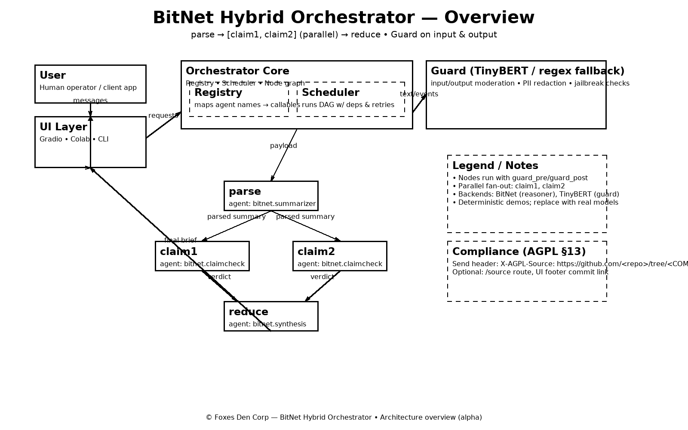

# BitNet Hybrid Orchestrator

_Compact, edge-ready orchestration that blends **hierarchical**, **parallel**, and **sequential** patterns with **BitNet** for reasoning and **TinyBERT** for dual-layer safeguards._

<div align="center">

<a href="../README.md">
  
</a>
&nbsp;
<a href="#architecture">
  
</a>
&nbsp;
<a href="./quickstart">
  
</a>

<br/><br/>

<a href="https://colab.research.google.com/gist/ShiySabiniano/a34e01bcfc227cddc55a6634f1823539/bitnet_tinybert_orchestrator_colab.ipynb">
  
</a>
&nbsp;
<a href="https://github.com/ShiySabiniano/bitnet-hybrid-orchestrator">
  
</a>
&nbsp;
<a href="../SECURITY.md">
  
</a>

</div>

> **Status:** alpha • **License:** AGPL-3.0-or-later • **Owner:** **Shiy Sabiniano**

---

## What is this?

A production-minded blueprint and runnable skeleton for **hybrid orchestration**:

- **BitNet agents**: summarize → claim-check → synthesize (swap in your BitNet runtime).
- **TinyBERT Guard**: input and output moderation + PII redaction (email/phone), optional ONNX model.
- **Mixed DAG**: sequential + parallel fan-out/fan-in, with timeouts, retries, and per-node guard hooks.
- **Config-as-data**: declarative pipelines via `orchestrator/pipeline.yml`.

Designed for **on-device / edge** targets (phones, SBCs, lean VPS). CPU-only demo; you can attach accelerated backends later.

---

## Quickstart

### One-click notebook (recommended)
**Open Colab:**  
➡️ <https://colab.research.google.com/gist/ShiySabiniano/a34e01bcfc227cddc55a6634f1823539/bitnet_tinybert_orchestrator_colab.ipynb>

- **Cell 6**: single-turn Web UI (form)  
- **Cell 6B**: **Chat mode** (multi-turn) that preserves history

### Local install
```bash
git clone https://github.com/ShiySabiniano/bitnet-hybrid-orchestrator.git
cd bitnet-hybrid-orchestrator
python -m venv .venv && source .venv/bin/activate   # Windows: .\.venv\Scripts\Activate.ps1
pip install -r orchestrator/requirements.txt
````

**Optional web UIs**

```bash
pip install -r ui/requirements.txt
python ui/chat_gradio.py        # multi-turn chat UI
# or copy the Colab "Cell 6" block into ui/gradio_demo.py and run:
# python ui/gradio_demo.py
```

More details: **[Quickstart](./quickstart.md)** · **[Colab guide](./colab.md)** · **[Chat mode](./chat.md)**

---

## Architecture



**Flow:** `parse → [claim1, claim2] (parallel) → reduce`, with **TinyBERT Guard** on input and output.
Per-node guard hooks can be enabled selectively (e.g., before tool/exec/network nodes).

Dive deeper: **[Architecture](./architecture.md)**

---

## Key features

* **Hybrid orchestration**: hierarchical planning + sequential steps + parallel branches
* **Safety first**: PII redaction; jailbreak/toxicity heuristics; optional TinyBERT ONNX scoring
* **Edge-friendly**: minimal deps, CPU-ready; swap in BitNet backends when available
* **Declarative pipelines**: edit `pipeline.yml` to change flow without touching code
* **Auditability**: attach “moderation cards” to node outputs for traceability

---

## API / configuration

* **Pipeline schema**: nodes, dependencies, thresholds, budgets
* **Conversation policy** (for chat): transcript window, persistence, redaction flags

See **[Pipeline API](./api.md)** and the chat sample **`orchestrator/pipeline.chat.yml`**.

---

## Roadmap

* BitNet adapter modules for popular runtimes
* Expanded guard taxonomies (beyond PII/jailbreak)
* RAG integration (DuckDB + FAISS)
* Web dashboard & metrics

Track progress: **[Roadmap](./roadmap.md)**

---

## Security & compliance

* **Vulnerability reports:** see **[SECURITY.md](../SECURITY.md)** (PGP key + safe-harbor).
* **License:** AGPL-3.0-or-later. If you host it, expose the running commit’s source (AGPL §13).
  How-to snippets: **[COMPLIANCE.md](../COMPLIANCE.md)**
* **Third-party licenses:** track model weights & libs in **THIRD\_PARTY\_LICENSES.md**.

---

## Links

* **Repository:** [https://github.com/ShiySabiniano/bitnet-hybrid-orchestrator](https://github.com/ShiySabiniano/bitnet-hybrid-orchestrator)
* **Issues:** [https://github.com/ShiySabiniano/bitnet-hybrid-orchestrator/issues](https://github.com/ShiySabiniano/bitnet-hybrid-orchestrator/issues)
* **Discussions:** [https://github.com/ShiySabiniano/bitnet-hybrid-orchestrator/discussions](https://github.com/ShiySabiniano/bitnet-hybrid-orchestrator/discussions)
* **Security advisories (private):** [https://github.com/ShiySabiniano/bitnet-hybrid-orchestrator/security/advisories/new](https://github.com/ShiySabiniano/bitnet-hybrid-orchestrator/security/advisories/new)

---

```
::contentReference[oaicite:0]{index=0}
```

```
::contentReference[oaicite:0]{index=0}
```
